## Who are we?

The training team includes members of both Genomics Aotearoa and REANNZ (Research and Education Advanced Network New Zealand), as well as our team of GA Training Affiliates who volunteer their time.  

All workshops are led by an **Instructor**: *subject matter experts who deliver high-level knowledge of the topic, demonstrating code in real-time*.

All workshops are supported by **Helpers**: *knowledgeable people who answer one-off questions or help you to solve issues as they arise*.  

**All workshops** have one or more Instructors or Helpers who have *received formal training from The Carpentries or an equivalent*.

## Get to know the team

<table>
  <tr>
    <td>
      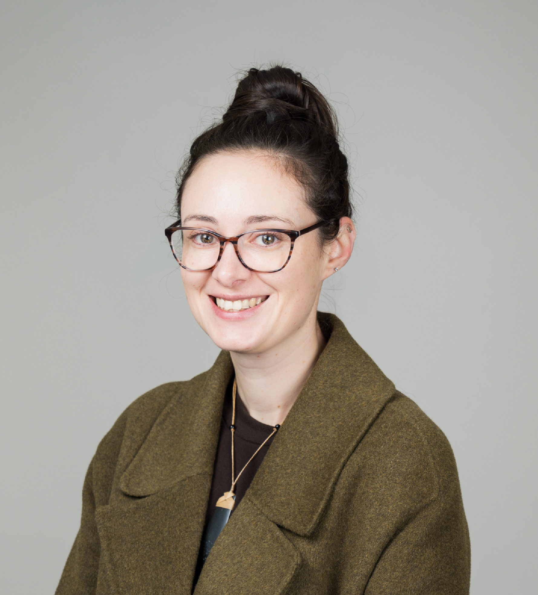
    </td>
    <td style="padding-left:20px; text-align: justify;">
      <strong>Bioinformatics Training Coordinator: Dr Chloé van der Burg, GA</strong> 
      Chloé joins GA from the University of Otago, where she previously worked as a postdoctoral researcher exploring the genetic and behavioural mechanisms driving protogynous sex change in the New Zealand Spotty wrasse. Her research background broadly encompasses exploring evolutionary and functional genomics in a range of both invertebrate and vertebrate species. Chloé completed her PhD at the Queensland University of Technology (Brisbane, Australia), before moving to Dunedin, New Zealand in 2022. She brings a strong expertise in genomics, transcriptomics and bioinformatics and a passion for teaching to her role as training coordinator. 

      Connect with Chloé on [Github](https://github.com/chloevdb) or [LinkedIn](https://www.linkedin.com/in/chloe-van-der-burg-26ab341a7/) 
    </td>
  </tr>
</table>

\

<table>
  <tr>
    <td>
      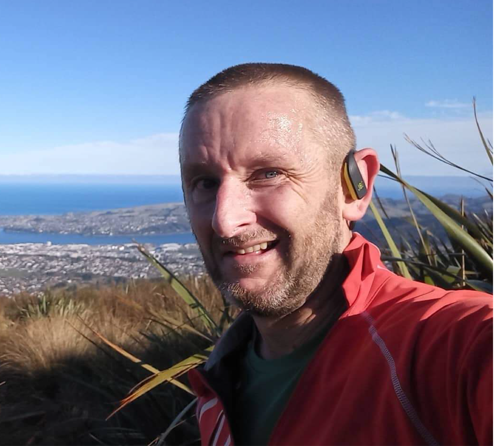
    </td>
    <td style="padding-left:20px; text-align: justify;">
      <strong>Matt Bixley, REANNZ</strong> 
      Research Support Specialist Matt Bixley is an R expert, passionate trainer and self-professed data science nerd. With a background in quantitative genetics, Matt's skills have been employed with research in primary production (AgResearch New Zealand) and human health (Department of Biochemistry, University of Otago). 

      Connect with Matt on [LinkedIn](https://www.linkedin.com/in/matt-bixley-01a047255/) 
      
    </td>
  </tr>
</table>

\

<table>
  <tr>
    <td>
      
    </td>
    <td style="padding-left:20px; text-align: justify;">
      <strong>Professor Michael Black (Mik Black, GA)</strong> 
      Co-Director of Genomics Aotearoa and Chair of the Bioinformatics Leadership Team, Mik is deeply involved in both research and the development of bioinformatics capability and infrastructure in New Zealand. Based out of the University of Otago's Department of Biochemistry, [Mik's research focus](https://www.otago.ac.nz/biochemistry/people/profile?id=352) leans towards cancer and human health. 
      
    </td>
  </tr>
</table>

\

## Training Affiliates

Our ***Training Affiliates*** are early-mid career researchers and scientists who volunteer their time to help teach in our Bioinformatics Training Programme and have expertise across a range of genomic and bioinformatic disciplines. 

<table>
  <tr>
    <td>
      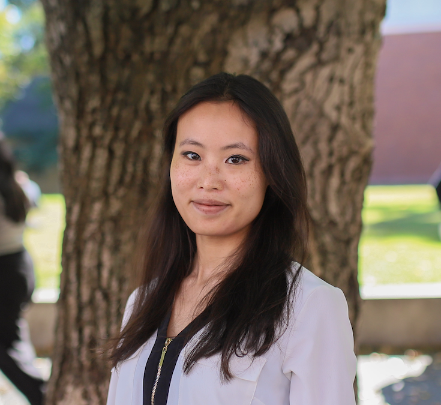
    </td>
    <td style="padding-left:20px; text-align: justify;">
      <strong>Dr Clare Adams, University of Otago</strong> 
      I am a Postdoctoral Fellow in Genetic Data Science at the University of Otago, currently working on applying quantitative genetic methods to predict metabolic disease. This work focuses on GBLUP statistical modelling, population-aware analyses, and reproducible, code-driven workflows in R, Unix, and high-performance computing environments. My research career has also spanned population genomics, environmental DNA (eDNA), and field-based ecology where my main interest was in developing eDNA methodology for population genetic usage. I value collaborative, transparent genomic methods that are ethically grounded and responsive to Aotearoa New Zealand’s unique biological and social context. 
      
      I’m always happy for a coffee chat, please feel free to reach out via [email](mailto:c.adams@otago.ac.nz) or [LinkedIn](https://www.linkedin.com/in/ciadams/).   

    </td>
  </tr>
</table>

\

<table>
  <tr>
    <td>
      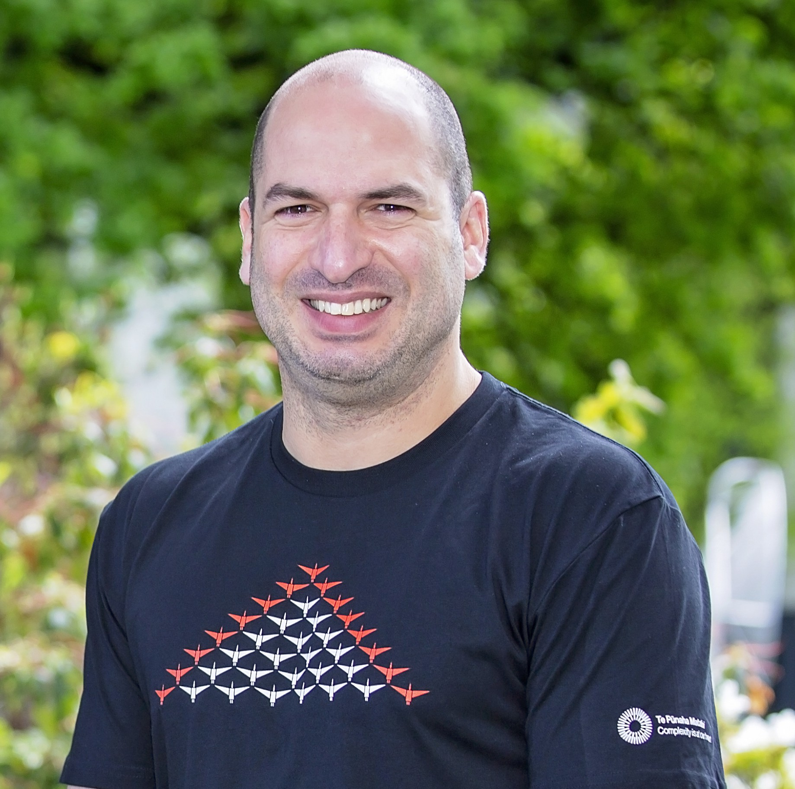
    </td>
    <td style="padding-left:20px; text-align: justify;">
      <strong>Dr Valter Almeida, Massey University Tāwharau Ora - School of Veterinary Science (mEpiLab)</strong> 
      Dr Valter Almeida is a Research Officer at Massey University with expertise in bioinformatics, genomics, and gut microbiome metagenomics. He investigates gut microbiome diversity, zoonotic infectious diseases, and microbial transmission between humans, livestock, and wildlife using large-scale metagenomic datasets and high-performance computing. 

      Connect with Valter via [email](mailto:V.Almeida@massey.ac.nz).
    </td>
  </tr>
</table>

\

<table>
  <tr>
    <td>
      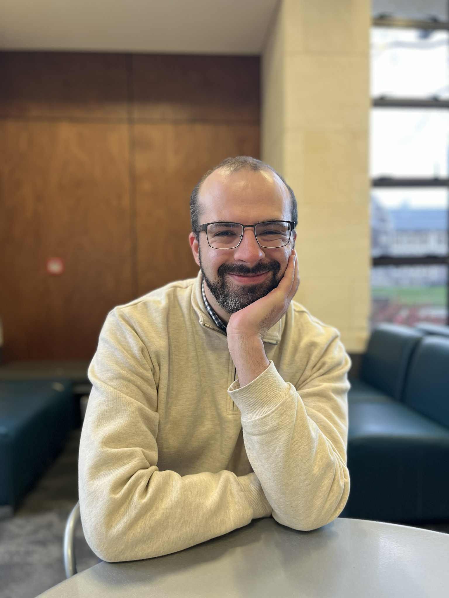
    </td>
    <td style="padding-left:20px; text-align: justify;">
      <strong>Dr Alastair Lamont, University of Otago</strong> 
       Dr Alastair Lamont is a Postdoctoral Fellow with the Department of Mathematics and Statistics at the University of Otago. He is interested in applying statistical methodologies to improve prediction of human genetic traits, particularly in indigenous peoples.  

      You can reach Alastair at [alastair.lamont@otago.ac.nz](mailto:alastair.lamont@otago.ac.nz)
    </td>
  </tr>
</table>

\

<table>
  <tr>
    <td>
      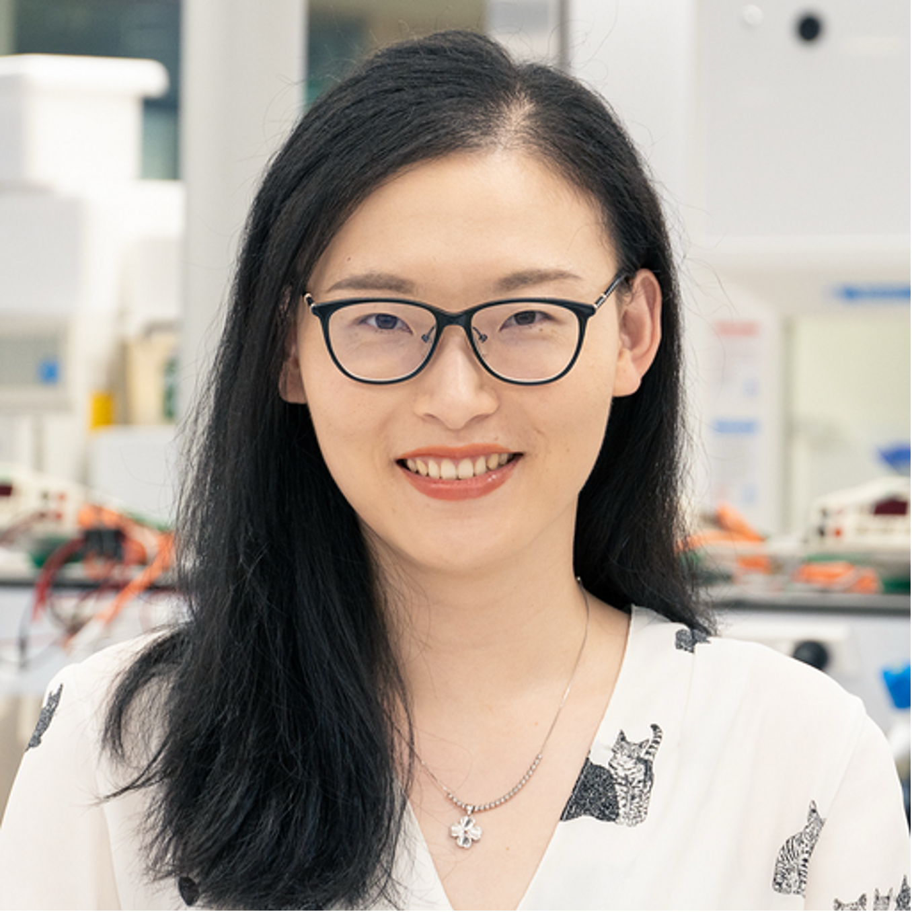
    </td>
    <td style="padding-left:20px; text-align: justify;">
      <strong>Dr Jieyun Wu, Centre for eResearch (University of Auckland)</strong> 
      Jieyun is an eResearch Engagement Specialist at the Centre for eResearch, University of Auckland, where she supports researchers in adopting digital tools and computational practices. During her nearly five years at Auckland Genomics, Jieyun provided genomics sequencing and bioinformatics support to dozens of research groups across New Zealand universities and PROs, where she discovered her passion for data science and helping researchers build computational confidence. Prior to this, she worked as a Scientist at the Ministry for Primary Industries, developing eDNA-based biosecurity surveillance tools. Jieyun holds a PhD in environmental microbiology from the University of Auckland.
      
      Connect with Jieyun via [email](mailto:Jieyun.wu@auckland.ac.nz) or [LinkedIn](https://www.linkedin.com/in/jieyun-wu-36720170/) 
  
    </td>
  </tr>
</table>

\

<table>
  <tr>
    <td>
      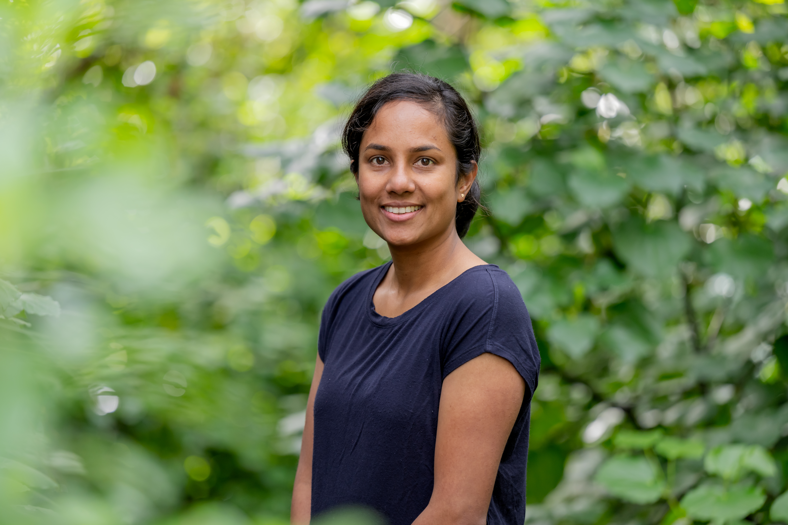
    </td>
    <td style="padding-left:20px; text-align: justify;">
      <strong>Amali Thrimawithana, BSI and University of Auckland</strong> 
      Kia ora! I’m a senior bioinformatician at Bioeconomy Science Institute, with broad experience across genomics, transcriptomics, metagenomics, and comparative analyses, working with species ranging from microbes and insect to fish and plants. My current focus is on microbiomes and their interactions with taonga species such as mānuka and tamure, a topic I am currently investigating in my PhD (final year) with Bioeconomy Science Institute and the University of Auckland.
      
      I’d love to connect, so please reach out to me on [email](mailto:amali.thrimawithana@plantandfood.co.nz) or [Linkedln](https://www.linkedin.com/in/amali-thrimawithana-b7313835/) 
  
    </td>
  </tr>
</table>

\

<table>
  <tr>
    <td>
      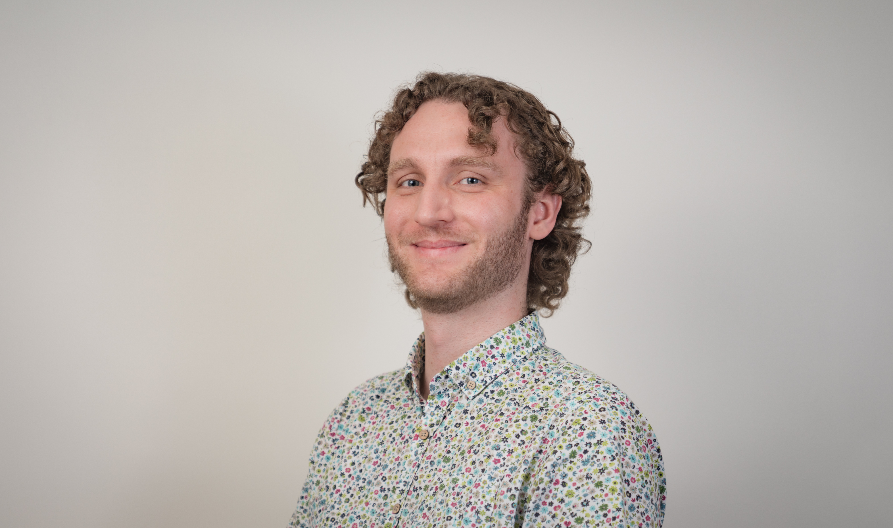
    </td>
    <td style="padding-left:20px; text-align: justify;">
      <strong>Dr Ben Halliday, University of Otago </strong> 
      I am a Research Fellow in the Laboratory for Genomic Medicine at the University of Otago. My research focuses on applying genomic data in high-performance computing environments to help whānau affected by rare genetic diseases. This research spans genome sequence analysis, genome assembly, and pangenomics. 
      
      Feel free to reach out for a chat via [email](mailto:benjamin.halliday@otago.ac.nz)
  
    </td>
  </tr>
</table>

\

<table>
  <tr>
    <td>
      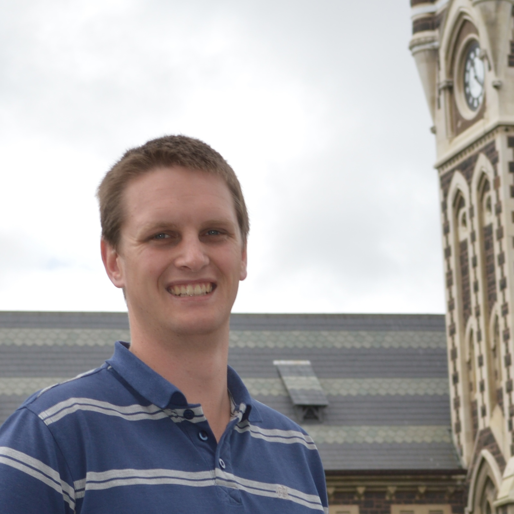
    </td>
    <td style="padding-left:20px; text-align: justify;">
      <strong>Dr Murray Cadzow, University of Otago </strong> 
      Murray is a Research Software Engineer within eResearch Support, Digital Services at the University of Otago. Murray has a background in bioinformatics, primarily in human complex disease genetics. His speciality is helping researchers deal with scale and big data. Murray has been heavily involved with computational literacy, reproducibility, and bioinformatic training at Otago and nationally. Murray is certified both as a Carpentries Instructor, and Instructor Trainer.
      
      Contact Murray at [murray.cadzow@otago.ac.nz](mailto:murray.cadzow@otago.ac.nz)
  
    </td>
  </tr>
</table>

\

<table>
  <tr>
    <td>
      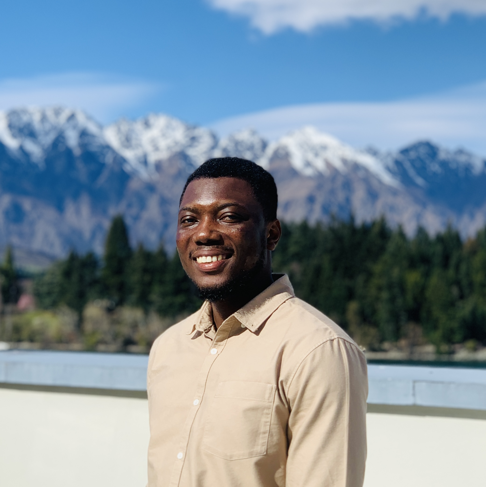
    </td>
    <td style="padding-left:20px; text-align: justify;">
      <strong>Elijah Atta Manu, University of Otago </strong> 
      I am currently pursuing a PhD in Physiology at the University of Otago. My research is aimed at addressing the mechanisms that drive cancer progression, especially breast cancer, which is a major public health challenge here in New Zealand. My work combines bioinformatic analysis of breast cancer transcriptomes with a wide range of complementary wet‑lab techniques, including High Content Screening, immunofluorescence, western blotting, and RT‑qPCR.
      
      I am passionate about sharing knowledge and building capability in bioinformatics, and I’m always happy to support others in developing these skills. Feel free to contact me via my [otago email](mailto:attel530@student.otago.ac.nz), [personal email](mailto:elijahattamanu@gmail.com) or connect on [LinkedIn](www.linkedin.com/in/eattamanu).
  
    </td>
  </tr>
</table>

\

<table>
  <tr>
    <td>
      
    </td>
    <td style="padding-left:20px; text-align: justify;">
      <strong>Dr Sara Burgess, Massey University</strong> 
      Contact Sara at [S.Burgess1@massey.ac.nz](mailto:S.Burgess1@massey.ac.nz)
  
    </td>
  </tr>
</table>

\

  

## Past team members

<table>
  <tr>
    <td>
      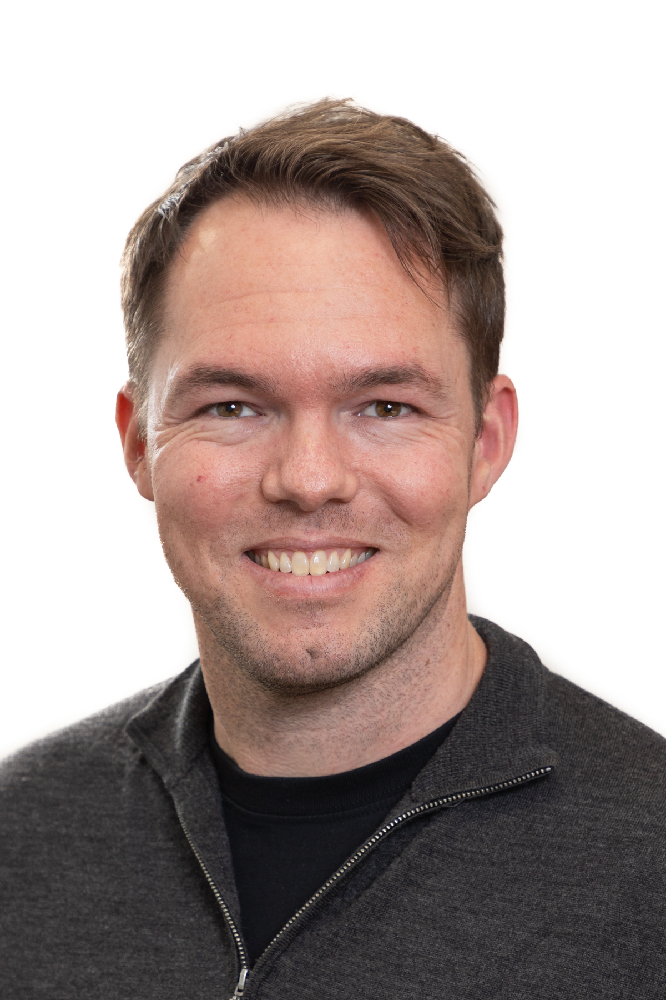
    </td>
    <td style="padding-left:20px; text-align: justify;">
      <strong>Bioinformatics Training Coordinator: Dr Tyler McInnes, GA</strong> 
      Tyler completed a PhD in the Centre for Translational Cancer Research at the University of Otago, utilising a bioinformatics skill set to analyse DNA methylation patterns in colorectal cancer. Following a passion for education, Tyler joined the Genetics Teaching Programme as a Teaching Fellow, working closely with Māori and Pacific students while developing and delivering a portfolio of material to assist student learning and improve outcomes. As a Training Coordinator for Genomics Aotearoa, Tyler coordinated a team of trainers, working with members of the community to deliver training material. 
      
      Connect with Tyler on <a href="https://www.linkedin.com/in/tyler-mcinnes-bb787bb4/">LinkedIn</a> 
    </td>
  </tr>
</table>

</table>

<table>

<table>
  <tr>
    <td>
      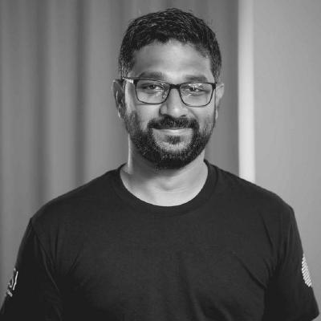
    </td>
    <td style="padding-left:20px;text-align: justify;">
      <strong>Dinindu Senanayake, NeSI</strong> 
      Genomics Support Specialist at NeSI, Dini is a 'fixer' - widely known and highly regarded in the New Zealand data science community, Dini has used his skills to solve a broad range of challenges. A command line expert with an eye for detail, Dini was involved in both writing and instructing many workshops. 

      Connect with Dini on <a href="https://github.com/DininduSenanayake">Github</a>

</td>
  </tr>
</table>

</table>

<table>

<table>
  <tr>
    <td>
      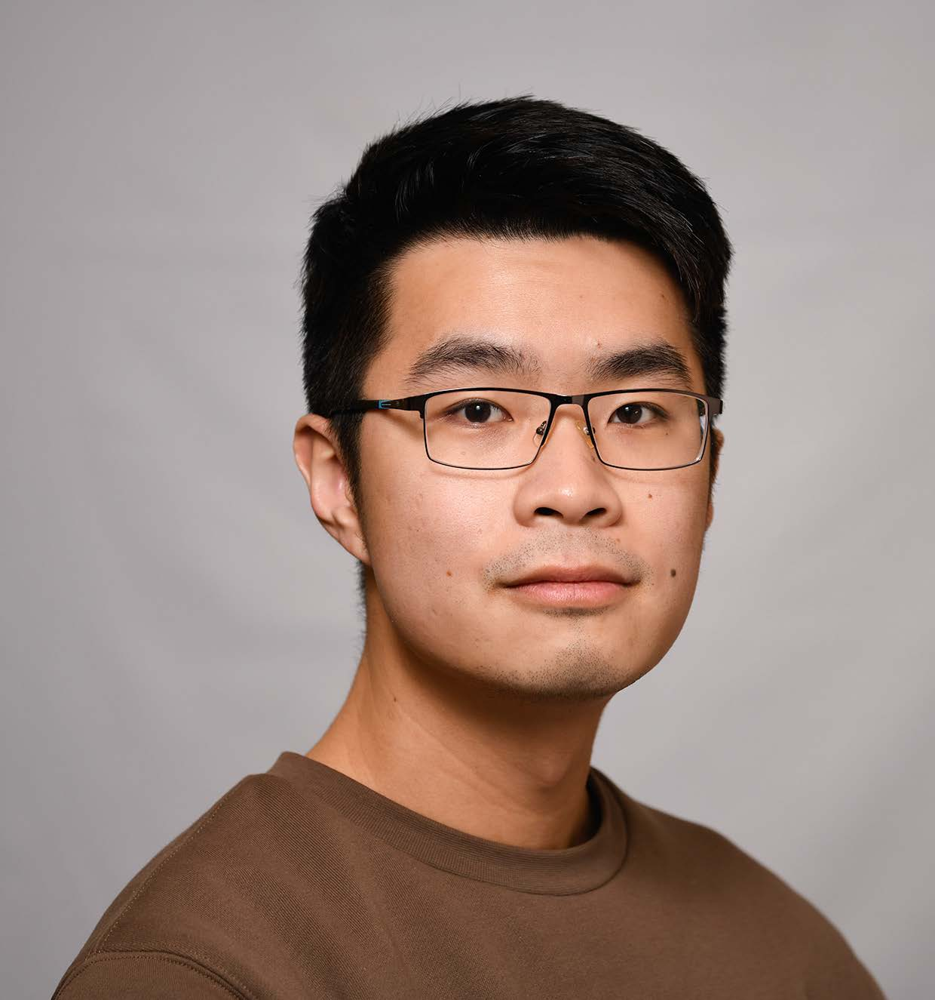
    </td>
    <td style="padding-left:20px;text-align: justify;">
      <strong>Bioinformatics Training Coordinator: Dr Jian Sheng Boey, GA</strong> 
      Boey completed a PhD in Environmental Microbiology at the University of Auckland. Boey  worked as a Postdoctoral Fellow and a Training Coordinator, and has bioinformatics skill set that is both broad and deep. Boey has a personal aim of taking complicated, complex data and making it accessible. As a Training Coordinator Boey maintained the Genomics Aotearoa Github repositories and was responsible for the Metagenomics Summer School, an in-person, four-day intensive held annually at the University of Auckland. 
      
      Connect with Boey on [LinkedIn](https://www.linkedin.com/in/jian-sheng-boey-873a17bb/). 
</td>
  </tr>
</table>

</table>

<table>

<table>
  <tr>
    <td>
      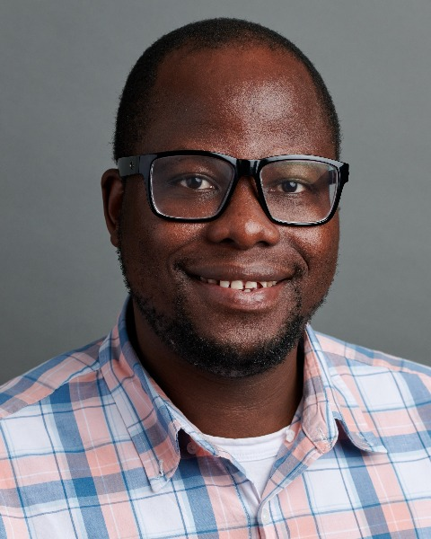
    </td>
    <td style="padding-left:20px;text-align: justify;">
      <strong>Bioinformatics Training Coordinator: Ngoni Faya, GA</strong> 
      Ngoni joined GA in 2019 after completing his PhD in Genetics at Massey University. With expertise in RNA-seq analysis, he led and collaborated with GA postdocs and principal investigators to deliver specialized genomics data analysis training workshops. He is proud to have been among the first globally to run the Genomics Data Carpentry workshop, and above all helping NZ researchers build essential data analysis skills. Ngoni later left GA in 2022 to pursue his passion for clinical genetics, and he now serves as a Medical Director at Knight Diagnostic Laboratories and Assistant Professor of Molecular and Medical Genetics at Oregon Health & Science University in USA.  

    Connect with Ngoni on [LinkedIn](https://www.linkedin.com/in/ngoni-faya/). 
</td>
  </tr>
</table>

