::: {style="text-align: center;"}
# Overview of Programme
:::

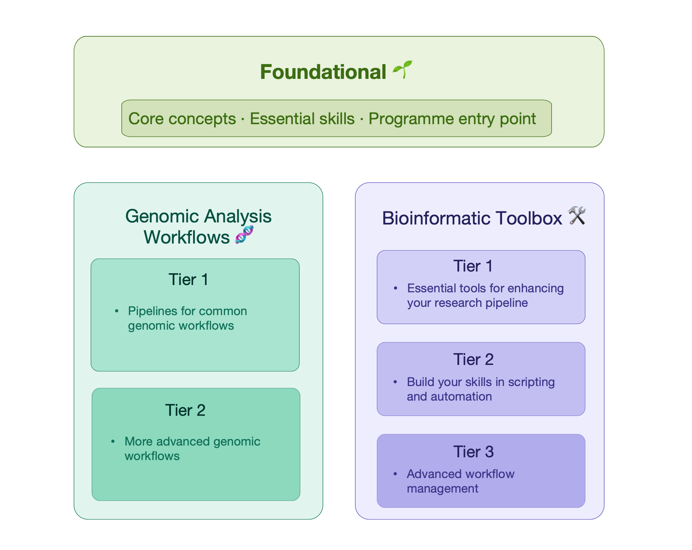

### Foundational 🌱

| Core skills |
|------------|
| • [Introduction to Shell for bioinformatics](#intro-shell) • [Introduction to R for bioinformatics](#intro-r) • [Genomic Data Carpentry (Aotearoa edition)](#genomic-data-carpentry-nz) — *coming soon...* |

### Genomic Analysis Workflows 🧬

|         Tier 1           |           Tier 2           |
|--------------------------|----------------------------|
| • [RNA-seq Data Analysis](#rnaseq) • [Microbial genome assembly with short reads](#microbial-genome-assembly) • [Long read genome assembly](#long-read-genome-assembly) |  • [Single-cell RNA-seq Data Analysis](#scRNAseq) • [Constructing Pangenome Graphs](#pangenome-graphs) • [Outlier analysis](#outlier-analysis) • [Scaling gene regulatory network simulations](#scaling-GRN-simulations) | 

### Bioinformatic Toolbox 🛠️

|  Tier 1  |  Tier 2  |   Tier 3    |
|-----------------------|-----------|---------|
| • [Visualisation with ggplot2](#visualisation-w-ggplot2) &nbsp;      • [Reproducibility with Git and Quarto](#git-and-quarto)  &nbsp;&nbsp;  | • [Intermediate Shell for bioinformatics](#intermediate-shell) • [Intermediate R for bioinformatics](#intermediate-r) • [Introduction to Bash Scripting and HPC Job Scheduler](#bash-script-hpc-job)  | • [Reproducible Bioinformatics with Nextflow](#nextflow) • [Introduction to Software Containers](#software-containers) |

\

#### *Got a workshop topic suggestion?* [Let us know!](ContactUs.qmd)
\
{width="70%"}

\

::: {style="text-align: center;"}
# Full Programme 
:::

---

## Foundational 🌱
*A prerequisite skill base for all genomic analysis workflows and bioinformatic skills. All learners are expected to have basic knowledge of biological and genetic concepts before attending these workshops, but no prior computational or genomic analysis experience is required.*

---

\

::: {.workshop-block}
::: {.workshop-header-row}
#### **Introduction to Shell for bioinformatics**  &nbsp; | &nbsp; Foundational 🌱 {#intro-shell}
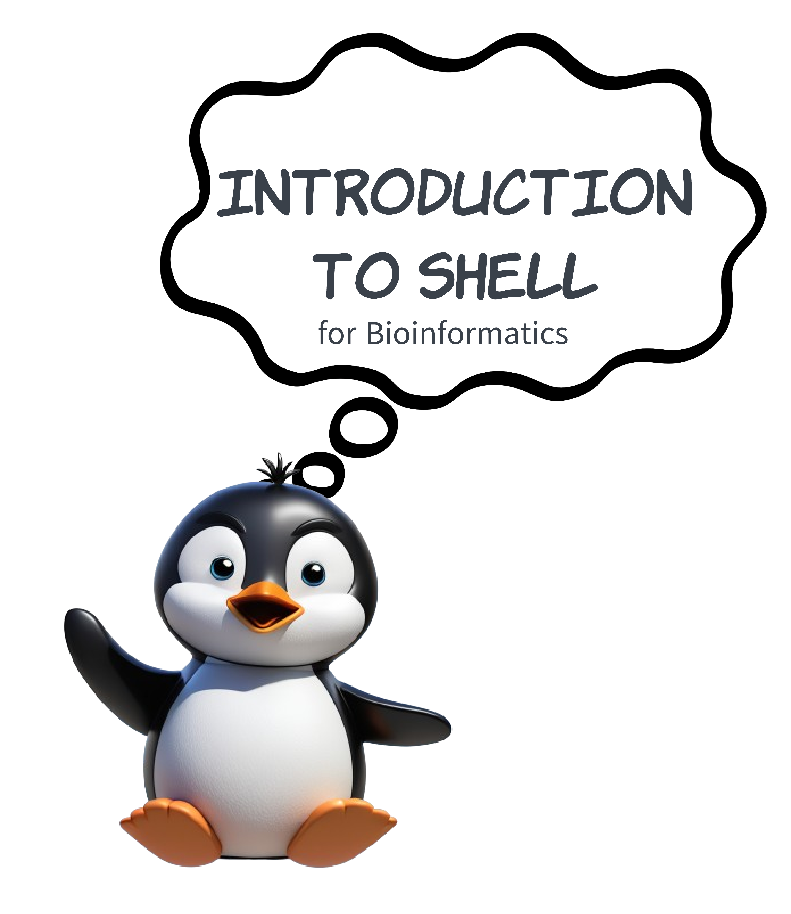
:::

Learn the fundamentals of working with the Command Line Interface (CLI). Shell is a program that allows you to interact with the command line. Familiarity with the shell will allow you to access remote servers, automate tasks, and use a wide range of tools that are unavailable on a Graphical User Interface (GUI).

During this workshop you will learn:

- The importance of the shell.
- How to navigate files and directories.
- How to create, view and modify files.
- Pipes, redirection, and scripts, which will allow you to automate your workflow.

**Prerequisites:** We assume the learner has no prior experience with the tools covered in the workshop. However, learners are expected to have some familiarity with biological and genetic concepts.

**Format:** Taught over one day (10am - 4pm) or two half days (9:30am-12:30pm).    
&nbsp;  
**View the full workshop material here:** [Introduction to Shell](https://genomicsaotearoa.github.io/introduction-to-shell/)  

:::

---

::: {.workshop-block}
::: {.workshop-header-row}
#### **Introduction to R for bioinformatics** &nbsp; | &nbsp; Foundational 🌱 {#intro-r}

:::

Get started with R, a highly popular programming language in the fields of biology and statistics. R is world-renowned for producing high-quality, publication-ready figures and tables.  

Some of the topics covered in the workshop are:

- An introduction to R and RStudio.
- R basics: The R language, reading data into R, storing data as objects, R packages.  
- Publication-quality data presentation using `ggplot2`.
- Where to get more help when you are ready to do more.

**Prerequisites:** We assume the learner has no prior experience with the tools covered in the workshop. However, learners are expected to have some familiarity with biological and genetic concepts.

**Format:** Taught over one day (10am - 4pm) or two half days (9:30am-12:30pm).   
&nbsp;  
**View the full workshop material here:** [Introduction to R](https://genomicsaotearoa.github.io/Introduction-to-R/)  

:::

---

::: {.workshop-block}
::: {.workshop-header-row}
#### **Genomic Data Carpentry (Aotearoa edition)** &nbsp; | &nbsp; Foundational 🌱 {#genomic-data-carpentry-nz}
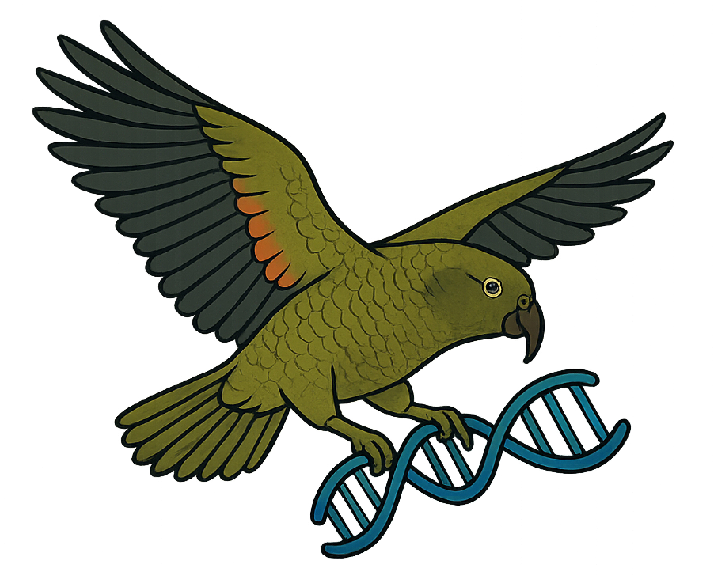
:::

This is a beginner-friendly workshop, designed to get you started with the world of genomics. Whatever you’re doing—whether it’s transcriptomics, genome assembly, variant calling, metagenomics, or something else—if you will be using genomic data this workshop is for you!

**Prerequisites:** We assume the learner has no prior experience with working with genomic data or with computational tools. However, learners are expected to have some familiarity with biological and genetic concepts.

This workshop is ***coming soon!...*** in the meantime, check out the [Data Carpentry lesson resources on Genomics Workshops](https://datacarpentry.github.io/genomics-workshop/index.html)

:::

---

\

## Genomic Analysis Workflows 🧬
*These workshops focus on taking you through the full pipeline of analysis for a specific genomic workflow.*  

- ***Tier 1*** *workshops introduce learners to common genomic workflows, with some foundational knowledge of R, shell and genomic data required as a prerequisite.*   
- ***Tier 2*** *workshops cover more advanced genomic analysis techniques, and require some previous knowledge or familiarity with working through a genomic analysis workflow. Additionally, learners should be comfortable using shell and/or R.*  

---

::: {.workshop-block}
::: {.workshop-header-row}
#### **RNA-seq Data Analysis** &nbsp; | &nbsp; Workflow 🧬: Tier 1 {#rnaseq}
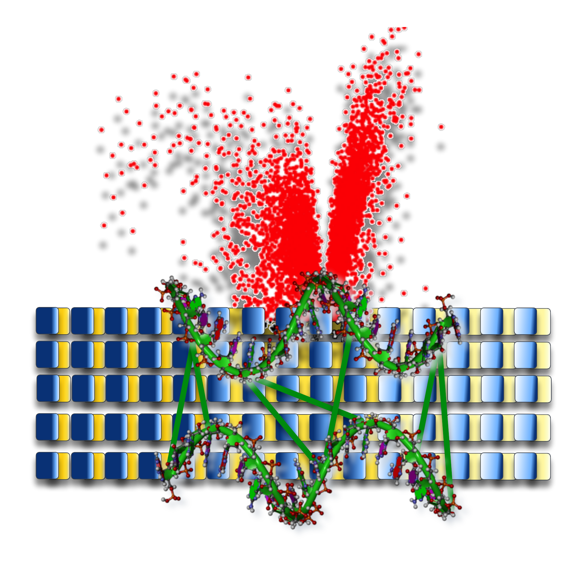
:::

Get started with analysing short read RNA-seq datasets, identifying differentially expressed genes and highlighting impacted biological processes.  
Some of the topics covered in the workshop are:

- Quality assessment
- Trimming and filtering
- Mapping and read counts
- Differential expression analysis
- Over-representation analysis

**Prerequisites:** This is a beginner-friendly workshop and no prior experience in analysing RNA-seq data is required. However, we assume the learner has foundational genomic, R and shell knowledge. See our Foundational programme for more details.    

**Format:** Taught over two half days (9am - 1pm).  
&nbsp;  
**View the full workshop material here:** [RNA-seq Data Analysis](https://genomicsaotearoa.github.io/RNA-seq-data-analysis-workflow/)  

:::

---

::: {.workshop-block}
::: {.workshop-header-row}
#### **Microbial genome assembly with short reads** &nbsp; | &nbsp; Workflow 🧬: Tier 1 {#microbial-genome-assembly}
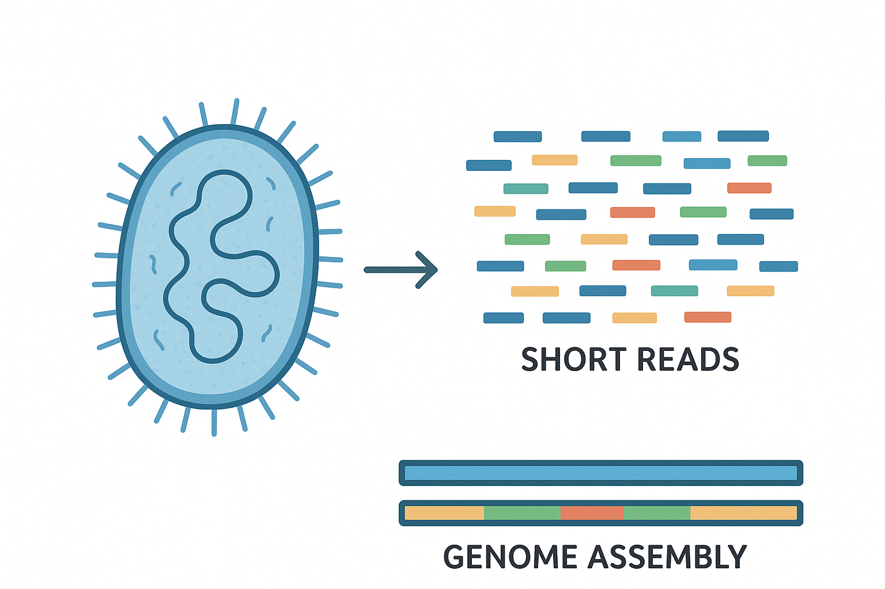
:::

This workshop aims to provide a comprehensive understanding of microbial genome assembly using short-read sequencing data.  
&nbsp;  
This workshop will cover:

- The principles of microbial genome assembly using short sequencing reads.  
- Differences between *de novo* and reference-guided assembly approaches.  
- Hands-on walkthrough of a genome assembly workflow.  
- Key considerations such as sequencing read length, depth, and contamination.  
- Genome annotation and visualisation techniques.  
- Practical examples using *Microcoleus* cyanobacterial sequencing data.  

**Prerequisites:** This is a beginner-friendly workshop and no prior experience in analysing microbial genomes is required. However, we assume the learner has foundational genomic, R and shell knowledge. See our Foundational programme for more details.      

**Format:** Taught over two half days (9am - 1pm).  
&nbsp;  
**View the full workshop material here:** [Microbial Genome Assembly with Short Reads](https://genomicsaotearoa.github.io/microbial_genomics_short_reads/)

:::

---

::: {.workshop-block}
::: {.workshop-header-row}
#### **Long read genome assembly** &nbsp; | &nbsp; Workflow 🧬: Tier 1 {#long-read-genome-assembly}
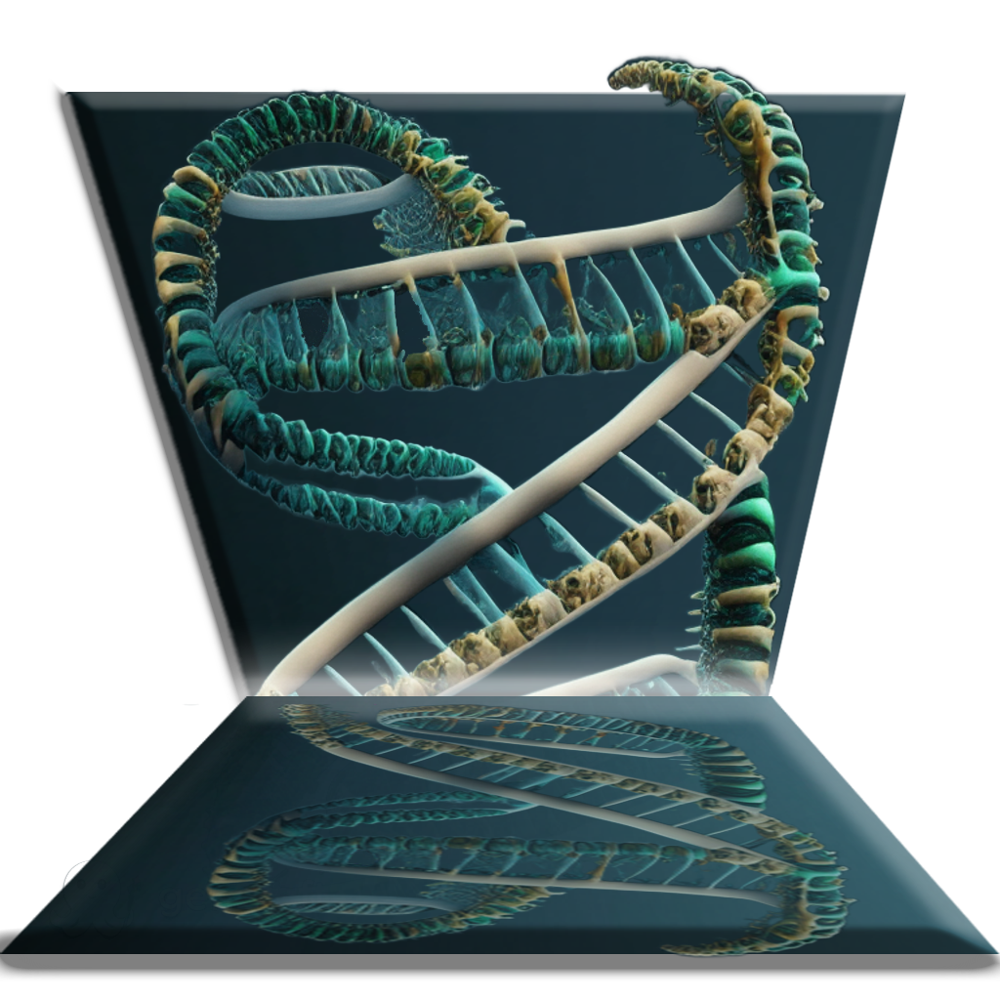
:::

This long read assembly workshop works through an entire genome assembly workflow including data QC, assembly, and assembly QC.  
&nbsp;  
Some of the topics covered:

- Sequence data basics: HiFi and UltraLong read data specifics  
- Quality Control (QC) of the data: cleaning, read length filtering. Overview of phasing.  
- Assembly of a genome: Verkko and Hifiasm, comparison of approaches.  
- Assembly QC: biological and technical assessments of the three Cs (contiguity, correctness, completeness).  
- Contiguity using gfastats  
- Correctness using Merqury  
- Completeness using asmgene  
- Assembly cleanup and genome annotation: contamination checks, Liftoff, MashMap, Minimap2.  
- Phased assemblies: benefits and examples.  

**Prerequisites:** This is a beginner-friendly workshop and no prior experience in assembling long read genomes is required. However, we assume the learner has foundational genomic, R and shell knowledge. See our Foundational programme for more details.   

**Format:** Taught over one day (10am - 4pm).  
&nbsp;  
**View the full workshop material here:** [Long read assembly](https://genomicsaotearoa.github.io/long-read-assembly-one-day/)

:::

---

::: {.workshop-block}
::: {.workshop-header-row}
#### **Single-cell RNA-seq data analysis** &nbsp; | &nbsp; Workflow 🧬: Tier 2 {#scRNAseq}

:::

Learn the skills and tools required for the analysis of single-cell RNA-seq data (scRNA-seq data) in R.  
&nbsp;  
This workshop covers:

- Alignment and feature counting with Cell Ranger (briefly).  
- QC and exploratory analysis.  
- Normalisation.  
- Sctransform: Variant Stabilising transformation.  
- Feature selection and dimensionality reduction.  
- Batch correction and data set integration.  
- Clustering.  
- Identification of cluster marker genes.  
- Differential gene expression analysis.  
- Differential abundance.  

**Prerequisites:** This is an intermediate-advanced workshop which requires an intermediate level of R knowledge and familarity with working through a genomic analysis pipeline (*e.g.,* any tier 1 workflow). To participate, you must have completed [Intermediate R](#intermediate-r) or have equivalent experience.  

**Format:** Taught over 4 half days (9am – 1pm).  
&nbsp;  
**View the full workshop material here:** [Analysis of single-cell RNA-seq data](https://genomicsaotearoa.github.io/scRNA-seq-data-analysis/)

:::

---

::: {.workshop-block}
::: {.workshop-header-row}
#### **Constructing Pangenome Graphs** &nbsp; | &nbsp; Workflow 🧬: Tier 2 {#pangenome-graphs}
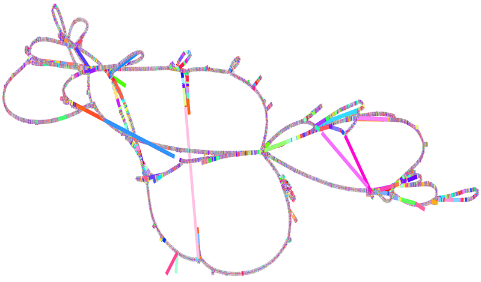
:::

How to construct a pangenome graph using PGGB, including QC, variant extraction, and short-read mapping.  
&nbsp;  
This workshop will include:

- Introduction to pangenome graphs.  
- Setup guide for using the tools and data.  
- Overview of the PGGB toolkit.  
- Choosing parameters to construct a graph.  
- QC, extracting variant data, mapping short reads.  

**Prerequisites:** Comfortable working with Shell. Have completed [Introduction to shell](#intro-shell) or have equivalent knowledge (*e.g.,* Able to navigate files/directories, use full vs relative paths, and use a command-line text editor.)  

**Format:** Taught over one half day (10am - 2:30 pm).  
&nbsp;  
**View the full workshop material here:** [Unlock the Power of Pangenome Graphs](https://genomicsaotearoa.github.io/Pangenome-Graphs-Workshop/)

:::

---

::: {.workshop-block}
::: {.workshop-header-row}
#### **Outlier Analysis** &nbsp; | &nbsp; Workflow 🧬: Tier 2 {#outlier-analysis}
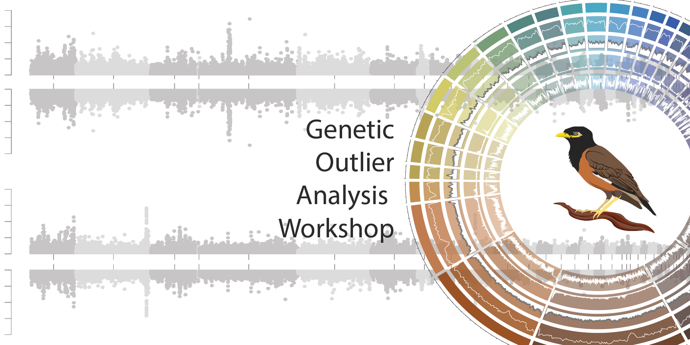
:::

Identify genomic regions under selection using the outlier analysis method.  
&nbsp;  
During this workshop:

- Download example genomic data or prepare your own.  
- Use PCAdapt to identify outlier loci.  
- Use VCFtools to identify outlier SNPs in population comparisons.  
- Use Bayescan to identify outlier SNPs based on allele frequencies.  
- Relate identified SNPs to phenotypic variation.  
- Compare results of different methods and discuss findings.  

**Prerequisites:** Comfortable using R and shell. Some knowledge of genomic selection.  

**Format:** Taught over two full days (10am - 4pm).  
&nbsp;  
**View the full workshop material here:** [Outlier Analysis](https://genomicsaotearoa.github.io/Outlier_Analysis_Workshop/)

:::

---

::: {.workshop-block}
::: {.workshop-header-row}
#### **Scaling Gene Regulatory Networks Simulations** &nbsp; | &nbsp; Workflow 🧬: Tier 2 {#scaling-GRN-simulations}
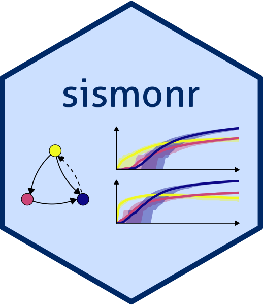
:::

Simulate gene regulatory networks using R and Julia.  
&nbsp;  
This workshop will include:

- Why simulations are valuable in systems biology.  
- What regulatory networks are and how to model them.  
- Using the `sismonr` R package to simulate a small network.  
- Introduction to HPC: architectures, batch systems, and Slurm.  
- How to scale up simulations on HPC via profiling and optimisation.  

**Prerequisites:** Comfortable using shell and R; some HPC knowledge preferred. 

**Format:** Taught over two full days (10am - 4pm).  
&nbsp;  
**View the full workshop material here:** [Scaling Gene Regulatory Networks Simulations](https://genomicsaotearoa.github.io/Gene_Regulatory_Networks_Simulation_Workshop/)

:::

---

::: {.workshop-block}  

&nbsp;  

::: {.workshop-header-row}
#### **Mini-series: GOseq for non-model organisms** &nbsp; | &nbsp; Workflow 🧬: Tier 2 {#goseq}

::: 

&nbsp;

We get deep into the nitty-gritty of how to perform gene ontology (GO) analysis for non-model organisms. Specifically, we run through GOseq analysis in R, focusing on how to perform this for organisms that are not in the supported organisms list in `goseq()` and don’t have an annotation package in Bioconductor. You can [check if your research organism is listed here.](https://bioconductor.org/packages/release/BiocViews.html#___OrgDb) If not, this workshop might be for you.

This is an extension on our [RNA-seq Data Analysis](https://genomicsaotearoa.github.io/RNA-seq-data-analysis-workflow/) workshop, which covers GOseq analysis using the supported organism *Saccharomyces cerevisiae* in the lesson on Functional analysis.  

**Prerequisites:** Have attended our [Introduction to R](https://genomicsaotearoa.github.io/Introduction-to-R/) workshop or have equivalent experience. Have attended our [RNA-seq Data Analysis](https://genomicsaotearoa.github.io/RNA-seq-data-analysis-workflow/) workshop, or have previous experience with an RNA-seq workflow.  

**Set-up:** This workshop is run locally on your own computer. Before the workshop, you must install R and RStudio. The full set-up instructions can be found at the top of the material.  

**Format:** Taught over two hours.  
&nbsp;  
**View the full workshop material here:** [GOseq for non-models](https://genomicsaotearoa.github.io/genomics-mini-series/mini-series-gene-ontology.html)  

:::

---

\

## Bioinformatic Toolbox 🛠️
*These workshops aim to provide you with the bioinformatic and computational skills to manipulate, manage and visualise your genomic data and are designed to complement our genomic analysis workflow programme.*  

- ***Tier 1*** *workshops require some foundational knowledge of R or shell, but are generally beginner-friendly.*   
- ***Tier 2*** *workshops require you to be more comfortable using R and shell, and it is expected you have previously spent some time practising using these tools on your own datasets.*  
- ***Tier 3*** *workshops are more advanced and require you to be comfortable with shell, high performance computational skills and genomic analysis pipelines.*

---

::: {.workshop-block}
::: {.workshop-header-row}
#### **Visualisation with ggplot2** &nbsp; | &nbsp; Toolbox 🛠️: Tier 1 {#visualisation-w-ggplot2}

:::

Good visualisation is about more than just writing the correct code. Visualisation is communication, and good communication requires thinking about how we as the scientist/data analyst/creator convey our message to the reader. This one-day workshop will provide you with a toolbox of skills and code examples to help you create clear, visually interesting visualisations which accurately communicate a message. This includes some basic exploratory analysis, some minor data transformation, and then thinking about the visual story. Finally, a fully realised visualisation will be created. 

&nbsp;    
This workshop is split into four parts:

- Basic `ggplot2` format and showcase of what can be done.  
- Types of data visualisations and their impact on how we interpret the data.  
- Showcasing and exploring community visualisations.     
- Group walkthrough of creating a visualisation of example genomic data, evolving our plot from a simple boxplot to a refined visualisation.     

**Prerequisites:** Comfortable using R / R Studio at a beginner level (have completed [Introduction to R](#intro-r) or have equivalent experience). Some familiarity with `ggplot2` and tidyverse tools will be useful but not required.

**Format:** Taught over one day (10am - 4pm).  
&nbsp;    
**View the full workshop material here:** [From Start to Finish: Visualising Your Data](https://genomicsaotearoa.github.io/visualization_day/)  

:::

---

::: {.workshop-block}
::: {.workshop-header-row}
#### **Reproducibility with Git and Quarto** &nbsp; | &nbsp; Toolbox 🛠️: Tier 1 {#git-and-quarto}
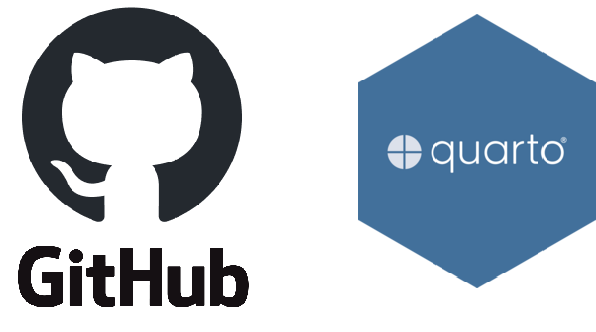
:::

Good research is about more than just doing the analysis; it's also about making your analysis reproducible, collaborative, and easy to share with your supervisor, your colleagues, or the wider scientific community.

This workshop will teach you how to:

- Use Git and GitHub to confidently host and manage your own code, and collaborate with others.  
- Tell the story of your analysis with clear, self-contained Quarto documents.  
- Create polished HTML outputs with well-documented code and embedded results.  
- Share your work with the world by publishing it as a website via GitHub Pages.

**Prerequisites:** We assume the learner has no prior experience with the tools covered in the workshop, but you must have attended our foundational level [Introduction to R](#intro-r) and [Introduction to Shell](#intro-shell) workshops, or have equivalent experience.  

**Set-up:** This workshop is run locally on your own computer. ***Before the workshop, you must install R, RStudio and Git, and make a GitHub account.*** The full [set-up instructions can be found here.](https://genomicsaotearoa.github.io/reproducibility_with_git_and_quarto/git_overview.html#setup-on-local-machine)

**Format:** Taught over two half days (9:30am - 2:30pm).  
&nbsp;  
**View the full workshop material here:** [Reproducibility with Git and Quarto](https://genomicsaotearoa.github.io/reproducibility_with_git_and_quarto/)  
:::

---

::: {.workshop-block}
::: {.workshop-header-row}
#### **Intermediate Shell for Bioinformatics** &nbsp; | &nbsp; Toolbox 🛠️: Tier 2 {#intermediate-shell}
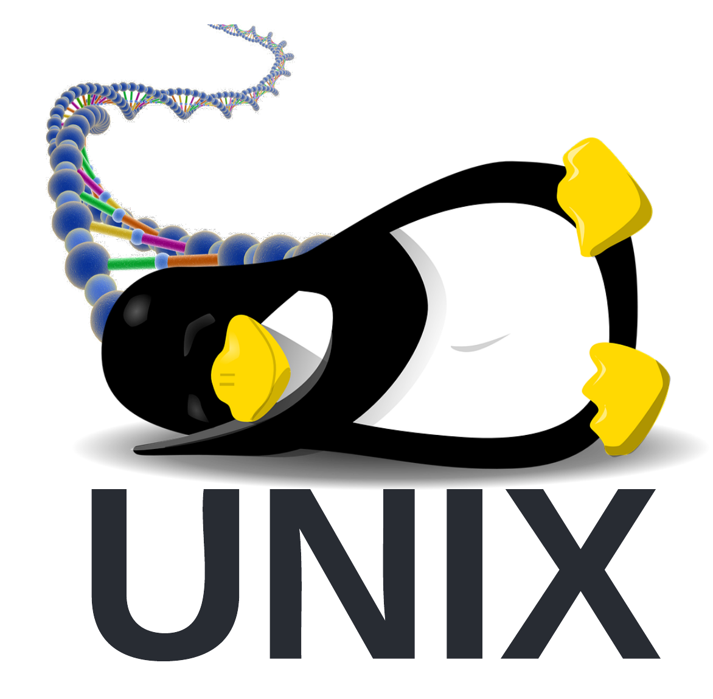
:::

Take your shell skills to the next level! This workshop builds on skills learnt in the Introduction to Shell workshop, and introduces new shell programmes for inspecting and manipulating text data and automating your file-processing.  

This workshop includes:

- An overview of the Shell, UNIX and Linux.  
- Downloading data from a remote source and checking data integrity.  
- Recap on redirection, pipes and command substitution.    
- Inspecting and manipulating data (the `cut`, `grep`, `sort`, `join`, `sed` and `awk` commands).  
- Challenges: solve example molecular biology problems using shell scripts.

**Prerequisites:** Comfortable using bash / shell (have completed [Introduction to Shell](#intro-shell) or have equivalent experience).

**Format:** Taught over one day (10am - 4pm).  
&nbsp;  
**View the full workshop material here:** [Intermediate Shell for Bioinformatics](https://genomicsaotearoa.github.io/shell-for-bioinformatics/)  

:::

---

::: {.workshop-block}
::: {.workshop-header-row}
#### **Intermediate R for bioinformatics** &nbsp; | &nbsp; Toolbox 🛠️: Tier 2 {#intermediate-r}

:::

Advance your skills with R! You will learn to complete R tasks with fewer lines of code, scale your analyses, and write readable code.  
Some of the topics covered in the workshop are:

- Introduction to relational data and the join function.  
- Working with regular expressions and functions from the stringr package.  
- Writing custom functions, working with conditional statements.  
- 'Defensive programming'.  
- Iterations - for loops, and `map_*()` functions.  
- The importance of data structure in R.

**Prerequisites:** Comfortable using R / R Studio (have completed [Introduction to R](#intro-r) or have equivalent experience). 

**Format:** Taught over two half days (9am - 1pm).  
&nbsp;  
**View the full workshop material here:** [Intermediate R](https://genomicsaotearoa.github.io/Intermediate-R/)  

:::

---

::: {.workshop-block}
::: {.workshop-header-row}
#### **Bash Scripting and HPC Job Scheduler** &nbsp; | &nbsp; Toolbox 🛠️: Tier 2 {#bash-script-hpc-job}
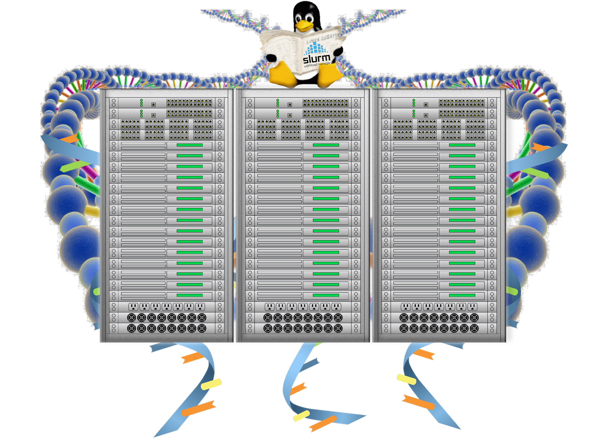
:::

Write your own bash scripts for data analysis and working on an HPC (high performance computing) environment to optimise and automate your genomic workflow. This workshop is an excellent follow-on for learners who have recently completed a tier 1 or tier 2 genomic analysis workflow.

Some of the topics covered in the workshop are:

- Designing a variant calling workflow.
- Automating a variant calling and RNAseq workflow.
- An introduction to HPC.
- Working with job scheduler.

**Prerequisites:** Comfortable using bash / shell (have completed [Introduction to Shell](#intro-shell) or have equivalent experience). Familiarity with any beginner (*e.g.,* tier 1) or more advanced (*e.g.,* tier 2) genomic analysis workflow.   

**Format:** Taught over one day (10am - 4pm).  
&nbsp;  
**View the full workshop material here:** [Introduction to Bash Scripting and HPC Scheduler](https://genomicsaotearoa.github.io/Workshop-Bash_Scripting_And_HPC_Job_Scheduler/)  

:::

---

\

::: {.workshop-block}
::: {.workshop-header-row}
#### **Reproducible Bioinformatics with Nextflow** &nbsp; | &nbsp; Toolbox 🛠️: Tier 3 {#nextflow}

:::
\
Reproducible research is of the utmost importance. Nextflow is a workflow engine for building complex, data-intensive pipelines. It runs the same pipeline unchanged on a laptop, an HPC cluster, or the cloud. Nextflow manages parallelisation, container integration, and checkpointing. Failed runs resume from the last successful step. The result is analyses that are reproducible, portable, and easy to share.

nf-core is a community-curated collection of over 100 production-ready pipelines built on Nextflow. It covers genomics, transcriptomics, proteomics, and other domains. Every pipeline is peer-reviewed, continuously tested, and ships with its software dependencies bundled in. Researchers can run a best-practice analysis with a single command.

Together, Nextflow and nf-core are the de facto standard for reproducible bioinformatics. This workshop equips participants with basic skills to run and customise Nextflow and nf-core pipelines.  
&nbsp;  
In this workshop you will:  

- Be introduced to Nextflow and execute an example pipeline.  
- Be introduced to nf-core, an online repository of curated pipelines.  
- Learn how to configure and customise an existing nf-core pipeline.  
- Generate metrics and reports.  

**Prerequisites:** Comfortable using bash / shell. Comfortable with any tier 1 or tier 2 genomic analysis workflow. Familiarity with HPC job scheduling and Git/GitHub will be useful but not required.      

**Format:** Taught over one half day (9:30 am - 1:00 pm).  
&nbsp;  
**View the full workshop material here:** [Reproducible Bioinformatics Workflows with Nextflow and nf-core](https://genomicsaotearoa.github.io/Nextflow_Workshop/)

:::

---

::: {.workshop-block}
::: {.workshop-header-row}
#### **Introduction to Software Containers** &nbsp; | &nbsp; Toolbox 🛠️: Tier 3 {#software-containers}

:::

This workshop introduces Apptainer, showing how to run a simple container and build your own, including running parallel scientific workloads on HPC clusters.  

**View the full workshop material here:** [Introduction to Software Containers](https://genomicsaotearoa.github.io/intro-to-containers/)

:::

---

